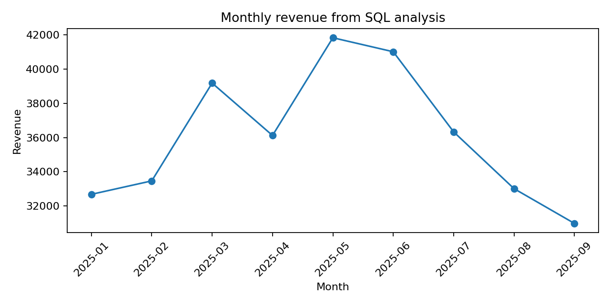

# SQL Business Analysis: Revenue, Customers & Product Performance

   **Role:** Data Analyst / SQL Analyst  
   **Dataset:** Synthetic / anonymized demo data created for portfolio use.  
   **Stack:** SQLite, SQL, CTEs, joins, window functions, pandas, matplotlib

   ## Business problem

    A retail/e-commerce business needs to understand revenue trends, category performance, repeat customers, top customers and country-level performance from normalized relational data.

   ## What was built

    Built a reproducible SQL analysis project using customers, products and orders tables. The project includes database creation, analytical SQL queries, CSV exports and a revenue trend chart.

   ## SQL concepts demonstrated

- JOINs across normalized tables
- GROUP BY aggregations
- CTE-based analysis
- Window functions
- Ranking top customers/products
- Monthly revenue analysis

  ## Business questions answered

1. How does revenue change by month?
2. Which product categories generate the most revenue?
3. Who are the top customers?
4. What share of customers are repeat buyers?
5. Which countries generate the highest revenue?

    ## Key outputs

    - `sql/analysis_queries.sql` — 5 business queries
- `results/query_*.csv` — query outputs
- `results/business_analysis.sqlite` — reproducible local database
- `results/monthly_revenue_sql.png` — revenue visualization

    ## How to run

    ```bash
    python -m venv .venv
    source .venv/bin/activate  # Windows: .venv\Scripts\activate
    pip install -r requirements.txt
    python src/main.py
    ```

    ## Resume-ready bullets

    - Built SQL analysis across normalized customer, product and order tables using joins, aggregations, CTE logic and window functions.
- Analyzed monthly revenue, repeat customer rate, category performance, top customers and country-level revenue efficiency.

 
